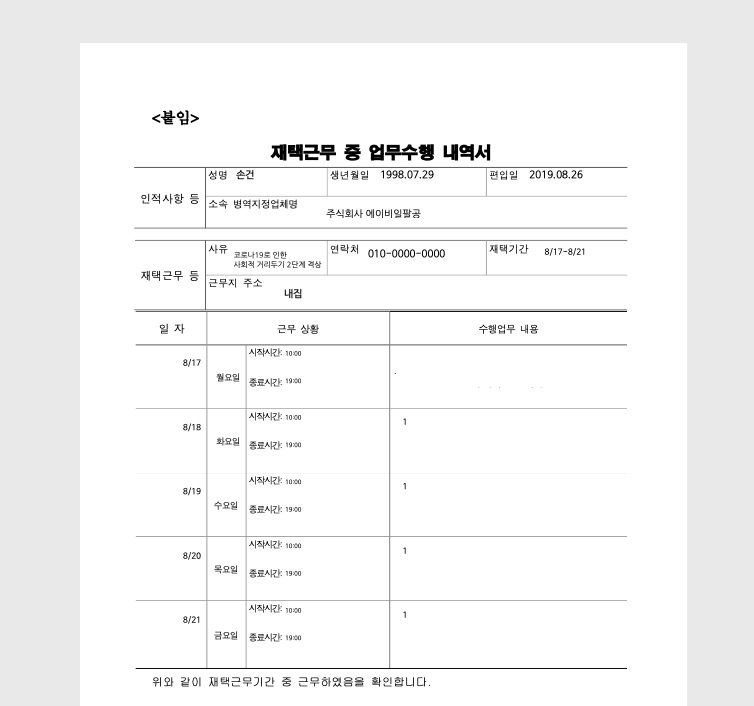

# workDiary

재택근무 pdf form을 채워줍니다

## Install
```
npm install -g https://github.com/jen6/workDiary
```

## Usage

### 기본 사용법
[spread sheet](https://abit.ly/workdiary)로 들어가서 사본을 만든 다음 각 칸을 채워 줍니다.  
날자는 반드시 월~금 사이 날자로 해주세요. 휴일이 끼었을 경우 그냥 휴일이라고 써놓읍시다.

다 작성 한 후 csv로 export 해서 저장해줍니다.
```
$ workDiary -csv csv.csv
```

### custom template option
회사 내에서 써야하는 pdf template이 바뀌었는데 전체적으로 위치가 밀린경우 custom template기능을 사용하면 됩니다.
`-template` 옵션으로 template pdf를 지정해주시고 `-x`, `-y` 옵션으로 좌표를 조정해줍니다.
전체적인 틀이 달라졌다면 사용할 수 없습니다. 안채우고 싶은 칸들은 csv상에서 비워주세요
```
$ workDiary -csv csv.csv -template template.pdf -x 0 -y 30
```


위 커맨드를 쉘에서 실행하면 "이름_시작일_종료일.pdf" 의 형태로 결과물이 나옵니다.
E.g. `손건_8_17_8_21.pdf`


